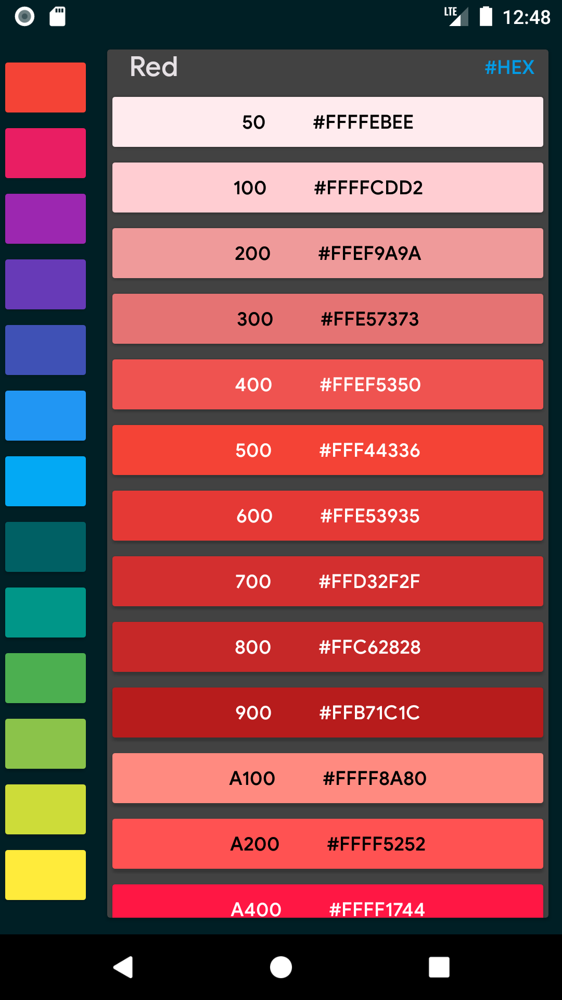

# ConvertX
<a href="https://apps.rustore.ru/app/ru.svolf.convertx" target="_blank">
</a>

This app converts strings with commonly used algorithms. API 26+

## Screens

|  |  |  |
|--|--|--|
|  |  |  |

## Converters

- Unicode
- Base64
- HEX

## Other
- History of decoding operations
- Hex Palette
- Regexp tester

## Build & Download

You can check [releases page](https://github.com/SnowVolf/ConvertX/releases) for latest version
You can also build this app from sources in Android Studio or Intellij IDEA (`Build -> Build Bundles -> Build APK`)

## Build and upload to Google Drive

The helper script can build an APK and upload it to a Google Drive folder through
[`rclone`](https://rclone.org/drive/). The uploaded filename contains the app
version from `app/version.properties`, the upload date, and the build variant:
`Convert X 2.1.3 (19.09.2026) release.apk`.

Configure an authenticated Google Drive remote once:

```bash
rclone config
```

Create a remote named `gdrive` with the Google Drive storage type. Then run:

```bash
./scripts/build-and-upload-drive.sh
```

Useful variants:

```bash
./scripts/build-and-upload-drive.sh --variant debug
./scripts/build-and-upload-drive.sh --variant both
./scripts/build-and-upload-drive.sh --folder "Convert X" --remote gdrive
./scripts/build-and-upload-drive.sh --variant release --no-upload
```

The default destination is the `Convert X` folder in the configured Drive
remote. Override it with `--folder` or the `DRIVE_FOLDER` environment variable.
The script does not store Google credentials in the repository.

