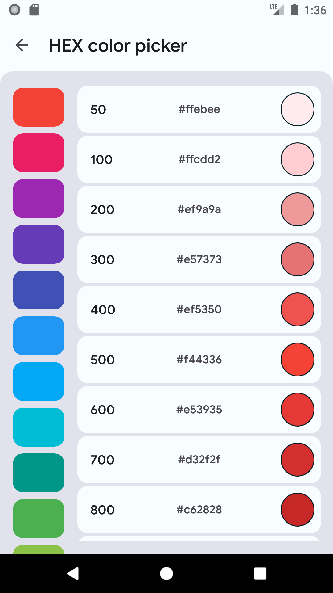

# ConvertX

This app converts strings with commonly used algorithms. API 26+

## Screens

|  |  |  |
|--|--|--|
|  |  | |

## Converters

- Unicode
- Base64
- HEX

## Other

- Hex Palette
- Regexp tester

## Build & Download

You can check [releases page](https://github.com/SnowVolf/ConvertX/releases) for latest version
You can also build this app from sources in Android Studio or Intellij IDEA (`Build -> Build Bundles -> Build APK`)

